# Judgement Card Game - Developer Journal

This document serves as a living record of how this project was built, module by module, including architectural decisions and explanations.

---

## Milestone 1: Project Setup & Health Check

### Objective
Initialize the Go backend, establish a clean architecture directory structure, and create a simple HTTP server with a `/health` endpoint to verify the server runs and accepts requests.

### Tech Stack Choices
* **Go Version**: `1.26.5`
* **Router**: `go-chi/chi/v5` - Chosen because it is lightweight, idiomatic, and relies on standard library `http.Handler` interfaces (unlike Gin or Echo), which promotes cleaner architecture and standard middleware reuse.

### Directory Structure
```
backend/
├── go.mod
├── go.sum
└── cmd/
    └── api/
        └── main.go
```
* `cmd/api/main.go`: Following the standard Go project layout, the `cmd/` directory is used for main executables. The `api/` subfolder explicitly denotes that this binary is the REST/WebSocket API server.

### Implementation Details & Explanation
Instead of pasting the code, here is the high-level logic of what we built in `main.go`:

* **Router Initialization (`chi.NewRouter`)**: We created an HTTP request multiplexer that routes incoming URLs to specific handler functions.
* **Middleware Stack**: We attached several essential middleware components:
  * **Recoverer**: Extremely important for production. If a bug in our code causes a "panic", this middleware catches it, returns an HTTP 500 status to the client, and keeps the server alive instead of crashing.
  * **Logger & RequestID**: To trace requests in our logs easily.
  * **Timeout**: To ensure no request hangs indefinitely.
* **Health Check Handler**: We bound the `/health` path to a simple function that responds with a `200 OK` status and a JSON payload (`{"status": "ok", "message": "Server is running"}`).

### Verification
The module was successfully initialized, and the health check endpoint responded successfully on `localhost:8080`.

---

## Milestone 2: Database & Configuration

### Objective
Set up a PostgreSQL database locally using Docker Compose, manage environment variables securely, and establish a database connection pool in Go.

### Tech Stack Choices
* **Database**: PostgreSQL 15 via Docker Compose.
* **Go Driver & ORM**: `jackc/pgx/v5` (driver) and `jmoiron/sqlx` (SQL extension). Chosen to execute raw SQL efficiently while avoiding "magic" ORMs, adhering to strong backend engineering practices.
* **Config Loader**: `joho/godotenv` to safely load `.env` variables in development.

### Directory Structure Additions
```
backend/
├── .env
├── .env.example
├── internal/
│   ├── config/
│   │   └── config.go
│   └── database/
│       └── db.go
...
docker-compose.yml
```
* `internal/`: A special directory in Go. Code inside `internal` cannot be imported by other projects. This is perfect for our private application logic.
* `config/`: Handles loading environment variables into a struct so the rest of the application doesn't need to read `os.Getenv` everywhere.
* `database/`: Manages the initialization of our database connection pool.

### Implementation Details & Explanation
* **`docker-compose.yml`**: Configured a `postgres:15-alpine` container, defining the database name, user, and password, mapping port 5433 to the host (to avoid conflicts with local DB instances), and using a volume for persistent data storage.
* **`config.go`**: We created a `LoadConfig()` function. It attempts to load `.env` files using `godotenv`. It then extracts `PORT` and `DB_URL` into a typed `AppConfig` struct. If `DB_URL` is missing, the application crashes immediately (`log.Fatal`)—this is the "fail fast" principle.
* **`db.go`**: We created a `Connect()` function that takes the database URL, opens a connection using `sqlx.Connect("pgx", url)`, and then sends a ping to the database to guarantee the connection is actually alive. It returns the connection pool pointer `*sqlx.DB`.
* **`main.go`**: We updated our entry point to first load the config, then initialize the database connection pool (with a `defer db.Close()` to ensure it shuts down cleanly), and finally start the HTTP server using the dynamically loaded port.

### Verification
The dependencies were successfully downloaded. The code is structured and the Go backend successfully connected to the PostgreSQL database in Docker!

---

## Milestone 3: Authentication API

### Objective
Implement a secure user authentication system including registration, login, password hashing, and JWT generation, using a purely clean architecture approach.

### Tech Stack Choices
* **Password Hashing**: `golang.org/x/crypto/bcrypt` - The industry standard for securely hashing passwords before storing them in the database.
* **Tokens**: `github.com/golang-jwt/jwt/v5` - For issuing JSON Web Tokens to authenticate clients statelessly.

### Directory Structure Additions
```
backend/
├── scripts/
│   └── schema.sql
├── internal/
│   ├── models/
│   │   └── user.go
│   └── auth/
│       ├── handler.go
│       ├── jwt.go
│       ├── repository.go
│       └── service.go
```

### Implementation Details & Explanation

* **Database Migration (`schema.sql` & `db.go`)**: We wrote a raw SQL script to create the `users` table with standard constraints (`UNIQUE`, `NOT NULL`). We updated `db.go` to automatically run this script upon startup by reading it via `os.ReadFile` and executing it with `db.Exec`.
* **Models (`user.go`)**: We created data structures defining how our `User` looks in the database, and strict payloads for `RegisterRequest` and `LoginRequest` so we can easily decode incoming JSON from clients. We carefully added `` json:"-" `` to the `PasswordHash` field to ensure we *never* accidentally send the password hash back to the frontend.
* **Clean Architecture Layers (`auth/`)**:
  * **Repository (`repository.go`)**: This layer is strictly for database interactions. `CreateUser` handles the `INSERT`, and `GetUserByEmail` handles the `SELECT`. It uses `sqlx` to map the returned rows directly into our `models.User` struct.
  * **Service (`service.go`)**: This layer handles business logic. The `Register` function hashes the plain-text password with `bcrypt`, creates the user model, calls the repository to save it, and issues a JWT token. The `Login` function fetches the user, compares the hashes, and returns a JWT token.
  * **JWT Generation (`jwt.go`)**: A small helper file that uses our `JWT_SECRET` (loaded from `.env`) to sign a token containing the `user_id` and an expiration time of 72 hours.
  * **Handler (`handler.go`)**: The HTTP layer. It binds to the `/register` and `/login` endpoints. It decodes the JSON request body, calls the `Service` layer, and formats the output (or errors) into standard JSON responses.
* **Wiring (`main.go`)**: We updated our main application to instantiate the `Repository`, inject it into the `Service`, and inject the `Service` into the `Handler` (Dependency Injection pattern). We then mounted the handler onto the `/api/v1/auth/` route.

### Verification
You can now restart the backend server and hit the registration endpoint to create a user and receive a JWT!

---

## Milestone 4: Lobby API

### Objective
Create a secure, authenticated REST API for users to create and join game lobbies. This is the foundation for matchmaking before users transition to real-time WebSockets.

### Tech Stack Choices
* **Database Transactions**: `jmoiron/sqlx` `Beginx()` - Used to ensure that when a lobby is created, the host is successfully added to the lobby simultaneously. If one fails, the database rolls back completely, preventing corrupted state.
* **Authentication Middleware**: Custom HTTP Middleware utilizing Go's `context` to extract user ID from JWTs.

### Directory Structure Additions
```
backend/
├── internal/
│   ├── middleware/
│   │   └── auth.go
│   ├── models/
│   │   └── lobby.go
│   └── lobby/
│       ├── handler.go
│       ├── repository.go
│       └── service.go
```

### Implementation Details & Explanation

* **Database Migrations (`schema.sql`)**: Added two relational tables. `lobbies` to track the game state (`waiting`, `in_progress`), host ID, and Max Players. `lobby_players` (a junction table) maps Users to Lobbies with `ON DELETE CASCADE` so if a lobby is deleted, the player associations are cleaned up automatically.
* **JWT Auth Middleware (`auth.go`)**: A critical security component. This middleware intercepts HTTP requests, extracts the `Authorization: Bearer <token>` header, cryptographically verifies the JWT, and extracts the `user_id`. It then securely injects this `user_id` into the `http.Request.Context()` so downstream handlers know exactly who is making the request without needing to manually decode the token every time.
* **Clean Architecture Layers (`lobby/`)**:
  * **Repository (`repository.go`)**: Employs a random string generator (e.g. `ABCD12`) for short, easily shareable Lobby codes (much better UX than UUIDs for a party game). Uses SQL Transactions (`tx.Beginx()`) when creating a lobby to insert into `lobbies` and `lobby_players` atomically.
  * **Service (`service.go`)**: Implements strict game logic. When joining a lobby, it checks if the game is already `in_progress` or if the `MaxPlayers` cap is reached. It is also idempotent (if a player is already in the lobby, it returns success rather than crashing).
  * **Handler (`handler.go`)**: Safely pulls the `userID` from the request context using `r.Context().Value(middleware.ContextUserIDKey)`. It decodes the incoming request and dispatches the action to the service.
* **Routing (`main.go`)**: We implemented Chi's `r.Group()` routing feature to apply the `AuthMiddleware` only to the `/api/v1/lobbies` endpoints, ensuring the `/auth` endpoints remain public.

### Verification
Users can now use their JWT token in an Authorization header to create a game lobby or join an existing one by its short code.

---

## Milestone 5: Deck, Shuffling & Dealing (Pure Logic)

### Objective
Build the isolated, core logic for a 52-card deck, uncoupled from any HTTP or Database layer. This demonstrates pure computer science mechanics (algorithms & data structures).

### Tech Stack Choices
* **Pure Go**: No external dependencies.
* **Testing framework**: Built-in Go `testing` package to ensure a robust and bug-free foundation.

### Directory Structure Additions
```
backend/
├── internal/
│   └── game/
│       ├── card.go
│       ├── deck.go
│       └── deck_test.go
```

### Implementation Details & Explanation

* **Domain Models (`card.go`)**: We created strongly typed constants (`Suit` and `Rank`) for cards. This prevents bugs (like accidentally typing "SPADE" instead of "SPADES") and gives us type safety when passing cards around in our logic engine.
* **Deck Engine (`deck.go`)**:
  * **Initialization**: The `NewDeck()` function builds a pristine 52-card array using a nested loop (4 suits x 13 ranks).
  * **Shuffling**: We implemented the **Fisher-Yates Shuffle algorithm**. Instead of relying on a slow external library, we iterate backward through the array and swap each element with a random earlier index using `math/rand`. It runs in purely `O(N)` time complexity.
  * **Dealing**: The `Deal()` function safely slices the deck matrix. It validates edge cases (e.g., trying to deal 20 cards to 4 players from a 52-card deck throws a clean error) and returns both the players' slice of hands and the remaining cards in the deck.
* **Unit Testing (`deck_test.go`)**: Writing unit tests is the hallmark of a professional backend engineer. We wrote test suites to prove:
  * A new deck contains exactly 52 unique cards.
  * The shuffling algorithm mutates the array order properly.
  * The dealing mechanism correctly distributes the right amount of cards and decrements the source deck accurately.
  * Edge case limits (dealing to 0 players or exceeding the deck size) properly throw errors instead of panicking.

### Verification
The test suite successfully passes, ensuring our core card logic is battle-ready for the actual game engine!

---

## Milestone 6: Bidding & Playing Logic

### Objective
Implement the strict ruleset of the Judgement game in memory, specifically handling player turns, trick bidding constraints, and the "must follow suit" playing rules.

### Tech Stack Choices
* **State Structs**: Standard Go Maps and Slices to manage memory-efficient state logic.

### Directory Structure Additions
```
backend/
├── internal/
│   └── game/
│       ├── logic.go
│       ├── state.go
│       └── logic_test.go
```

### Implementation Details & Explanation

* **State Management (`state.go`)**: We built a large `GameState` struct. This acts as the brain of an active match. It maps player IDs to their hands, scores, and bids. It also tracks the `Phase` of the game (e.g., `waiting`, `bidding`, `playing`).
* **Game Mechanics (`logic.go`)**:
  * **Bidding Enforcement (`PlaceBid`)**: We implemented the hallmark rule of Judgement: *The total number of bids cannot equal the number of cards dealt*. Our logic correctly calculates the running total of bids and dynamically rejects the final bidder's request if it violates this condition. It also strictly manages turn order (`TurnIndex`), throwing errors if a player tries to bid out of turn.
  * **Card Playing Enforcement (`PlayCard`)**: We implemented the trick-leading mechanics. The logic verifies that the player actually holds the card they are trying to play. Most importantly, it implements the **"Must Follow Suit"** rule: it checks the first card played in the trick (`CurrentTrick[0]`). If the current player tries to throw a different suit, the engine scans their hand. If it detects they are secretly hiding a card of the lead suit, it aggressively blocks the play and throws an error.
* **Unit Testing (`logic_test.go`)**: As always, robust tests were written to cover edge cases: bidding out of turn, hitting the exact bid constraint limit, and attempting to illegally play an off-suit card while holding the lead suit.

### Verification
All state tests passed successfully locally!

---

## Milestone 7: Trick Evaluation & Scoring

### Objective
Calculate the winner of a single trick based on the hierarchy of Trump suits vs Lead suits, and automatically tabulate the round scores at the end of the round based on players meeting their bids.

### Implementation Details & Explanation

* **Rank Hierarchy**: In `logic.go`, we created a `rankValue(r Rank)` function. Because our ranks are text strings (`"2"`, `"10"`, `"K"`, `"A"`), the computer doesn't natively know that an Ace is higher than a King. This function maps string ranks to integers (2 to 14) so the engine can do strict mathematical `<` or `>` comparisons.
* **Trick Evaluation (`evaluateTrick`)**:
  * We built the core judgement resolution engine. It triggers automatically when all players have played exactly 1 card into the `CurrentTrick`.
  * It iterates over the cards played to find the winner: 
    * If a **Trump suit** is played, the highest Trump card wins the trick, completely ignoring the lead suit.
    * If no Trump suit is played, the highest card of the **Lead suit** wins.
    * Any off-suit card (not Trump, not Lead) instantly loses, regardless of how high its rank is.
  * The winner's `TricksWon` count is incremented, the `CurrentTrick` is cleared out, and the winner is assigned the `TurnIndex` (the privilege to lead the next trick).
* **Round Scoring (`evaluateRound`)**:
  * Triggered automatically when players have 0 cards left in their hands.
  * Iterates through the players comparing their initial `Bid` against their actual `TricksWon`.
  * If they succeeded (bid == won), their global score is increased by `10 + bid`.
  * If they failed (bid != won), their score increases by `0`.

### Verification
A highly complex test was added to `logic_test.go`. The test artificially injects a scenario where Player 1 leads with the Ace of Spades. Player 2 has no Spades and throws a 2 of Hearts. Player 3 also has no Spades, but throws a 3 of Diamonds (the designated Trump). The engine successfully detects that the lowest Trump card (3 of Diamonds) mathematically beats the highest lead card (Ace of Spades) and correctly awards the score to Player 3!

---

## Milestone 8: WebSocket Foundation

### Objective
Upgrade standard HTTP connections to full-duplex WebSocket connections so players can stream real-time data back and forth with the server. Establish a concurrent `Hub` to map connected users into their specific game lobbies.

### Tech Stack Choices
* **Library**: `github.com/gorilla/websocket` (Industry standard for building highly scalable WebSocket servers in Go).
* **Concurrency**: Pure Go routines (`go readPump()`, `go writePump()`) and buffered channels to prevent one slow internet connection from blocking the entire lobby.

### Directory Structure Additions
```
backend/
├── internal/
│   └── ws/
│       ├── client.go
│       ├── handler.go
│       └── hub.go
```

### Implementation Details & Explanation

* **WebSocket Upgrade (`handler.go`)**: We created an endpoint at `GET /api/v1/lobbies/{lobbyID}/ws`. 
  * It intercepts the incoming request and extracts the user's ID via the JWT `AuthMiddleware` we built earlier (meaning only authenticated users can open a socket).
  * It extracts the `{lobbyID}` from the URL.
  * It uses the gorilla `Upgrader` to hijack the standard HTTP connection and swap it over to a TCP WebSocket pipeline.
* **The Client (`client.go`)**: Each user who connects gets a `Client` struct containing their personal memory space and `Send` channel. 
  * **`readPump`**: A goroutine loop that aggressively reads data flowing *in* from the user's browser. If the user unexpectedly disconnects (e.g., they close their laptop), this loop detects it instantly and triggers a cleanup.
  * **`writePump`**: A goroutine loop that acts as an output buffer. It also sends periodic ping-pongs to verify the browser is still alive and hasn't silently dropped off the network.
* **The Lobby Manager (`hub.go`)**: A central coordinator struct that manages all connected clients.
  * It uses a highly efficient 2D map: `map[LobbyID]map[*Client]bool`. This maps every unique lobby code to the exact users sitting inside that lobby.
  * When a user sends a message to the hub (e.g., "I just played the Ace of Spades"), the hub looks up the `LobbyID`, grabs all the other users sitting at that table, and instantly broadcasts the message to their `Send` channels.

### Verification
The module was successfully compiled and linked into `main.go`. The background goroutine for `wsHub.Run()` is successfully spinning in the background alongside the HTTP server, waiting to multiplex connections!

---

## Milestone 9: Game Event System

### Objective
Bridge the networking layer and the game logic layer by creating strict JSON protocols, and implement "State Sanitization" to prevent players from cheating by inspecting network traffic.

### Tech Stack Choices
* **Event-Driven Architecture**: Used an `Action` channel to funnel all user inputs into a single synchronous thread, completely eliminating race conditions.
* **JSON Marshaling**: Standard Go `encoding/json` combined with `json.RawMessage` to build a generic event wrapper system.

### Directory Structure Additions
```
backend/
├── internal/
│   └── ws/
│       └── events.go
```

### Implementation Details & Explanation

* **WebSocket Event Models (`events.go`)**:
  * We created an `Event` struct containing a string `Type` (e.g., `START_GAME`, `PLACE_BID`) and a `Payload` property.
  * This acts as the standard envelope for all messages sent over the socket.
* **Hub Game Integration (`hub.go` & `client.go`)**:
  * We added a `Games map[string]*game.GameState` to the Hub. This holds the active memory state of every game currently being played globally.
  * When `client.readPump()` receives text from a browser, it uses `json.Unmarshal` to parse the event and push it into the Hub's `Action` channel.
  * The Hub's `handleAction` switch statement intercepts this. If the user sends a `PLAY_CARD` event, the Hub parses the nested payload, calls `g.PlayCard()` on the game logic engine, and if an error occurs (e.g., "Not your turn"), it dynamically sends an `ERROR` event back *only* to that specific player!
* **State Sanitization (Anti-Cheat Security)**:
  * This is arguably the most critical security feature of the backend. When a player successfully places a bid, the Hub broadcasts the updated `GameState` JSON to the entire lobby.
  * However, if we sent the raw struct, clever players could press `F12` in their browser, inspect the WebSocket frames, and look at the `Hands` map to see exactly what cards their opponents are holding!
  * We wrote a `sendGameStateToClient` function. Before sending the state to a user, it makes a shallow copy of the state and **strips out all other players' hands** from the `Hands` map, ensuring the user only ever receives data they are explicitly allowed to see!

### Verification
The backend successfully compiles. The JSON structs and Action channels properly orchestrate traffic between the WebSockets and the core game loop!

---

## System Architecture

The backend of the Judgement Card Game is designed to be highly concurrent, secure, and scalable. It separates stateless HTTP traffic (like logging in) from stateful WebSocket traffic (like playing a game in real-time).

### The High-Level Architecture Diagram
*(You can paste the code below into any Graphviz viewer like Edotor.net to visualize the architecture)*

```dot
digraph SystemArchitecture {
    rankdir=LR;
    nodesep=0.6;
    ranksep=1.0;
    fontname="Helvetica";

    node [shape=box, style="rounded,filled", fontname="Helvetica", fontsize=11, margin=0.2];
    edge [fontname="Helvetica", fontsize=10, color="#555555"];

    // Clients
    subgraph cluster_clients {
        label="CLIENTS (Browsers/Apps)";
        style=filled; color="#e0f7fa";
        
        PlayerA [label="Player A", shape=ellipse, fillcolor="#00bcd4", fontcolor="white"];
        PlayerB [label="Player B", shape=ellipse, fillcolor="#00bcd4", fontcolor="white"];
    }

    // Go Backend
    subgraph cluster_backend {
        label="GO APPLICATION SERVER";
        style=filled; color="#f3e5f5";

        // REST API
        HTTPRouter [label="HTTP Router (chi)", fillcolor="#e1bee7"];
        AuthLobbyService [label="Auth & Lobby Services\n(Stateless)", fillcolor="#ce93d8"];

        // WebSockets
        WSUpgrader [label="WebSocket Upgrader", shape=hexagon, fillcolor="#81c784"];
        GoroutinesA [label="{ Player A Threads | { readPump() | writePump() } }", shape=record, fillcolor="#a5d6a7"];
        GoroutinesB [label="{ Player B Threads | { readPump() | writePump() } }", shape=record, fillcolor="#a5d6a7"];
        
        // Hub & Game
        Hub [label="Central Event Hub\n(Concurrency Manager)", shape=cylinder, fillcolor="#4caf50", fontcolor="white"];
        GameEngine [label="Pure Game Engine\n(Rules & State)", shape=box3d, fillcolor="#ffcc80"];
    }

    // Database
    Database [label="PostgreSQL DB", shape=cylinder, fillcolor="#1565c0", fontcolor="white"];

    // HTTP Flows
    PlayerA -> HTTPRouter [label=" POST /register"];
    HTTPRouter -> AuthLobbyService;
    AuthLobbyService -> Database [label=" SQL Insert"];
    
    // WS Flows
    PlayerA -> WSUpgrader [label=" WS Connect"];
    PlayerB -> WSUpgrader [label=" WS Connect"];
    WSUpgrader -> GoroutinesA;
    WSUpgrader -> GoroutinesB;

    GoroutinesA -> Hub [label=" Action Event (Channel)"];
    GoroutinesB -> Hub [label=" Action Event (Channel)"];
    
    Hub -> GameEngine [label=" Execute Move"];
    GameEngine -> Hub [label=" Updated State"];
    
    Hub -> GoroutinesA [label=" Sanitized State (Channel)"];
    Hub -> GoroutinesB [label=" Sanitized State (Channel)"];
}
```



### How the Architecture Works (In Simple Terms)

1. **The Stateless HTTP API (The Front Desk)**
   When a user visits the site to register, login, or create a lobby, they are using standard HTTP requests. Our Go router (`chi`) catches these requests. Because these actions are "Stateless" (meaning they don't require a permanent connection), the server quickly talks to the PostgreSQL database, saves the user, generates a secure JWT token, hands it back to the user, and immediately closes the connection.
2. **The WebSocket Upgrader (The Bridge)**
   When players are ready to start playing cards, standard HTTP is too slow (it would require the browser to constantly refresh the page to see if someone else played a card). Instead, the user sends their JWT token to the `/ws` endpoint. The server verifies the token and "upgrades" the connection from HTTP into a permanent, two-way TCP pipe called a WebSocket.
3. **Per-Client Goroutines (The Personal Assistants)**
   For every single user that connects, the Go backend spawns two extremely lightweight background threads (Goroutines):
   * `readPump()`: Constantly listens to the user's connection waiting for them to click a card.
   * `writePump()`: Acts as an output pipe, waiting to send data back to the user's screen.
4. **The Central Hub (The Traffic Cop)**
   If two players throw a card at the exact same millisecond, the server could crash trying to update the game memory at the same time (a Race Condition). To prevent this, all `readPump` threads dump their actions into a single queue inside the Central Hub. The Hub acts as a traffic cop, processing exactly one action at a time.
5. **The Pure Game Engine (The Rulebook)**
   The Hub passes the action (e.g., "Player A plays Ace of Spades") to the Game Engine. The Game Engine doesn't know about databases or the internet. It is pure mathematical logic. It checks the rules, validates the turn, mutates the memory state, and hands the new state back to the Hub.
6. **Fan-Out & State Sanitization (Anti-Cheat)**
   Once the Hub gets the new state, it needs to tell everyone what just happened. However, if it sent the raw memory state, clever players could inspect the network traffic and see everyone's hidden cards! Therefore, the Hub intercepts the state, deletes the opponents' cards from the data, and then "Fans-Out" (broadcasts) the sanitized JSON to everyone's `writePump` threads, instantly updating their screens.
