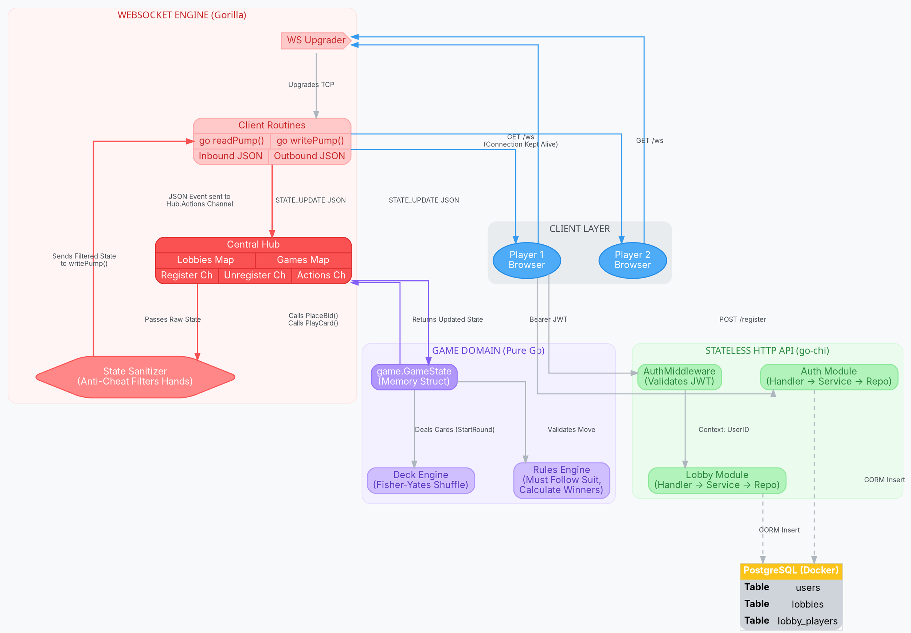

# Backend System Architecture: Judgement Card Game

*This document outlines the complete backend system architecture, concurrency model, and data flows for the Judgement multiplayer card game. It is formatted to be easily parsed by AI system design tools (like Eraser.io) or for onboarding new developers.*

---

## 1. High-Level Overview
The backend is a **Go (Golang)** application utilizing a Clean Architecture approach. It acts as a hybrid server, processing both **stateless HTTP requests** (for authentication and matchmaking) and **stateful, full-duplex WebSockets** (for real-time, low-latency game events).

## 2. Technology Stack
* **Language**: Go 1.26.5
* **HTTP Router**: `go-chi/chi/v5`
* **WebSocket Engine**: `gorilla/websocket`
* **Database**: PostgreSQL 15 (Dockerized)
* **ORM**: `gorm.io/gorm`
* **Authentication**: `golang-jwt/jwt/v5` & `bcrypt`

---

## 3. Core Components & Concurrency Model

### A. The Stateless HTTP API (The Front Desk)
Handles standard CRUD operations before a game starts.
* **Flow**: `Client` -> `Chi Router` -> `AuthMiddleware` -> `Handler` -> `Service` -> `Repository` -> `PostgreSQL`.
* **Concurrency**: Go implicitly spawns a lightweight goroutine for every incoming HTTP request. Once the DB query finishes and the response is sent, the thread is garbage collected.

### B. The WebSocket Upgrader (The Bridge)
Handles the transition from matchmaking to real-time gameplay.
* **Flow**: Clients hit `GET /api/v1/lobbies/{lobbyID}/ws` with their JWT token. The Gorilla Upgrader intercepts the request, validates the token, and keeps the TCP connection permanently open.

### C. Per-Client Goroutines (Memory Isolation)
For every connected user, the server spawns exactly **two permanent goroutines**:
1. `readPump()`: A continuous `for` loop that blocks on `conn.ReadMessage()`. When it receives a JSON action from the user, it unmarshals it and pushes it into the central Hub.
2. `writePump()`: A continuous `select` loop that acts as an output buffer, pulling JSON strings from a channel and writing them to the user's socket.

### D. The Central Hub (The Traffic Cop / Multiplexer)
The Hub is a singleton struct that manages the global state of all active lobbies.
* **The Problem**: If two players play a card at the exact same millisecond, concurrent mutations to the game state memory would cause race conditions and crash the server.
* **The Solution**: All `readPump` threads **"Fan-In"** to a single Go Channel (`Hub.Actions`). The Hub runs a single, sequential event loop. It processes one card play at a time, completely eliminating the need for complex `sync.Mutex` locks.

### E. The Pure Game Engine (The Rulebook)
A completely isolated domain package (`internal/game`) that knows nothing about HTTP or WebSockets. It contains pure Go structs (`GameState`, `Card`, `Deck`) and pure functions (`PlaceBid`, `PlayCard`, `EvaluateTrick`).

### F. State Sanitization & Fan-Out (Anti-Cheat)
Once the Hub mutates the `GameState`, it must broadcast the new state to the players.
* **Anti-Cheat**: Before broadcasting, the Hub clones the `GameState` and explicitly deletes all opponents' hands from the memory map. This guarantees that if a player inspects their WebSocket network traffic (via DevTools), they only see their own cards.
* **Fan-Out**: The Hub looks up the specific `LobbyID`, grabs all clients at that table, and pushes the sanitized JSON into their `writePump` channels simultaneously.

---

## 4. Graphviz / Eraser.io Architecture Diagram
*You can supply this DOT code to Eraser.io to generate a detailed component diagram.*

